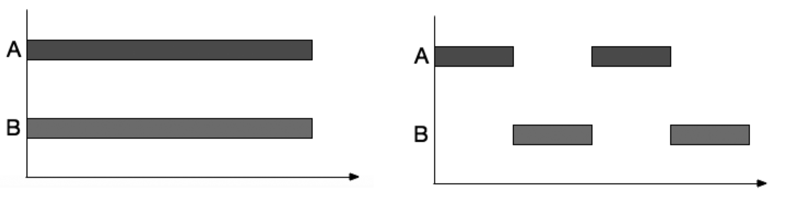

go语言高级编程

## 接口

### Duck Typing


#### 理解概念

一个对象像鸭子一样走路,像鸭子一样叫,那么这个对象就可以是鸭子.
duck typing是编程语言中的一个概念,意味着`像鸭子一样看待对象`

#### 基本思想

在使用对象时,不用关心它的类型具体是什么,而是关心它能够支持哪些属性和方法.如果一个对象满足我们的需求,那么我们就可以使用它.
Duck typing与静态类型语言中的类型系统相比,更加灵活和弹性。这种方法主要用于动态语言（如 Python）,也在Go语言中被广泛使用（通过接口实现）。

#### 示例代码

```python
def download(x):
    return x.get("google.com")
```

Python实现duck typing的代码如上,这段代码中的x可以是任何类型的对象, 且不对x进行验证,执行才知道x有没有get方法

```go
type Retriever interface {
Get(url string) string
}
```

在Go中,duck typing的实现是通过接口实现的,上述代码定义了一个接口retriever,接口中限定了一个方法Get,这个方法的参数是string类型,返回值是string类型.
一个结构体需要`定义Get方法,并且满足Get方法的参数和返回值类型`,那么这个结构体才可以被认为是retriever接口的实例.

### 概念

接口是Go语言中的一种类型,表示`一组方法签名（方法名、参数、返回值列表）的集合`。
接口类型不包含具体地实现,但是任何类型（包括结构体、函数、别名类型等）如果实现了接口中的所有方法,就可以被认为是该接口的实例。
`接口由使用者进行定义`,即接口由测试等人进行定义使用

### 示例代码

```go
type retriever interface {
Get(string) error // 这个接口包含着Get这个方法,同时限定了方法的参数和返回值
}
```

上述代码定义了一个接口retriever,接口中限定了一个方法Get,这个方法的参数是string类型,返回值是error类型.

```go
type Retriever1 struct {
}
func (Retriever1) Get(url string) error {
return nil
}

type Retriever2 struct{}

func (Retriever2) Get(url string) error {
fmt.Println("Get测试")
return nil
}

```

上述代码定义了两个结构,分别是Retriever1和Retriever2,这两个结构都实现了retriever接口中的Get方法,因此这两个结构都可以被认为是retriever接口的实例.可以使用以下方式进行使用:

```go
var retriever1 retriever = infra.Retriever{}
var retriever2 retriever = testing.Retriever{}

err1 := retriever1.Get(url)
err2 := retriever2.Get(url)
```

上述代码将两个不同的结构实例赋值给了接口,并且可以直接使用Get方法,虽然名字相同,但是实现的功能由各自的结构体决定.
[完整代码](interface/downloader.go)

另有通过[数据库连接](interface/sql/main.go)演示了面向过程和面向对象(多态)的区别

Go语言中,一个类型可以实现多个接口,当然,多个类型也可以实现同一个接口,任何一个类型必然实现了空接口,因此空接口可以表示任何类型.

### 接口赋值

接口赋值分为两种情况:

- 接口变量赋值给接口变量
- 满足接口方法的自定义类型的实例赋值给接口变量

如果自定义类型实现了某个接口类型所声明的方法,那么这么自定义类型的值就可以赋值给这个接口,这个赋值会把用户定义的类型的值存入接口类型的值,即类型的转换.

例如上面数据库连接中,声明了一个Mysql类型的变量m,我们可以直接将m赋值给IDatabaser,这样m的类型不再是Mysql而是IDatabaser.

在接口变量中,一共存储了两部分的信息:

- 分配给接口变量的具体值
- 值的类型的描述器(源类型)

当一个接口I1实现了方法A()和方法B()时,而接口I2只实现了方法A(),那么接口I1的值可以赋值给接口I2,但是接口I2的值不能赋值给接口I1.
因为I2的所有方法对于I1接口的实例而言都是可执行的,反之则无法保证.

### 空接口

`空接口(interface{})`是Go语言中最特殊的接口,Go语言中所有的类都可以认为是继承于空接口,因此空接口可以表示任何类型.

#### 空接口定义

空接口不包含任何的方法,所以 所有的类型都实现了空接口,因此空接口可以存储任意类型的数值.例如

```go
package main

import "fmt"

func Log(i interface{}) {
	fmt.Printf("type:%T,value:%v\n", i, i)
}

func main() {

	x := 1
	var interfs []interface{} = []interface{}{
		x,
		"hello",
		true,
		&x,
		struct { // 匿名结构
			Name string
		}{"小明"},
		[]int{1, 2, 3},
	}
	for _, interf := range interfs {
		Log(interf)
	}
}

/* Output:
type:int,value:1
type:string,value:hello
type:bool,value:true
type:*int,value:0x14000126008
type:struct { Name string },value:{小明}
type:[]int,value:[1 2 3]
*/
```

上面代码展示了空接口可以存储任意类型的数值.

#### 空接口取值

空接口的值可以通过类型断言将原来的值赋值给其他原生结构,例如

```go
str := interfs[1] //"hello",此时str类型为空接口
// var d string = str // 不能直接通过类型转换,因为变量str类型是空接口,不能直接转换为string类型
d := str.(string) //类型断言,将空接口转换为string类型
fmt.Println(d)
```

#### 空接口的应用

空接口可以作为函数的参数,这样函数就可以接收任意类型的参数,例如fmt.Println()函数就是一个接收空接口的函数.

```go
func Println(a ...interface{}) (n int, err error)
```

### 类型断言

`类型断言(assert)`是使用在接口变量上的操作,简单来说,接口类型向普通类型的转换就是类型断言(
猜,猜对了返回正确的,猜错了就返回初值).
基本语法如下:

```go
t, ok := X.(T)
```

其中X是一个接口变量,T是一个类型,t为X转换为T类型后的变量,ok为一个bool类型,表示断言是否成功. 如果失败,t则为T类型的零值,ok为false.

接口的断言有两种方式:

- ok-pattern
- switch-type

#### ok-pattern

一般来说 如果要断言的种类较少时,使用ok-pattern,其结构如下:

```go
if value, ok := x.(T);ok{
// T为具体的类型
// do something
}
```

#### switch-type

当断言的接口类型较多时,使用switch-type,其结构如下:

```go
switch value := x.(type) {
case T1:
// do something
case T2:
// do something
case T3:
// do something
case T4:
// do something
case T5:
// do something
case T6:
// do something
}
```

[示例代码](interface/assert/assert.go)

### 功能意义

接口在Go语言中起到了非常重要的作用：

* 实现多态：接口允许不同类型的值被统一地处理,因为它们都实现了同一个接口。
* 封装实现细节：接口的实现可以被隐藏,从而保护其实现细节不被外界误用或滥用。
* 增强代码灵活性：接口允许不同类型的实现在不同情况下被动态地切换。

总之,接口是Go语言中一种非常重要的抽象概念,能够帮助我们提高代码的灵活性、可扩展性和可维护性。

### 拓展

Go语言的接口是非侵入式的.
### nil值!=nil
[代码](/Users/zane/Documents/GitHub/ReLearnGo/advanced/interface/nilisnotnil/nilisnotnil.go)
## 错误处理

### [error](error)

Go语言中没有异常机制,但是有一个error接口,可以通过error接口来处理错误.

#### 自定义error

除了使用errors包中的New方法来创建自定义异常,还可以通过接口来创建.  
Go语言中的error类型实际上是一个接口,只要实现了Error() string方法即可,源代码如下:

```go
type error interface{
Error() string
}
```

自定义一个类型,实现返回string类型的Error()方法即可,代码如下:

```go
type ErrNegSqrt float64
func (e ErrNegSqrt) Error() string{
return fmt.Sprintf("不能对负数`%v`进行开根号", e)
}
```

[完整调用代码](error/error/error.go)

### [panic宕机](error/panic)

一般而言,只有当程序发生不可逆的错误时,才需要使用`panic`方法来触发宕机.  
panic方法是Go语言的内置函数,使用该方法后,程序将直接中断.
panic的源代码如下,可以看到panic方法接收一个interface{}类型的参数,该参数可以是任意类型.

```go
func panic(v interface{})
```

#### 调用panic的情形:

* 程序处于失控状态且无法恢复,继续执行会影响其他程序时
* 发生不可预知的错误时
* 程序运行到不应该运行到的地方时

### [recover宕机恢复](error/recover)

Go语言通过内置函数recover来捕获宕机,类似于其他语言的try-catch机制  
在使用panic方法触发宕机之后,且在退出当前函数前,会延迟调用defer语句

```go
package main

import "fmt"

func protect() {
	defer func() {
		fmt.Println("func protect 退出")
	}()
	panic("panic in protect")
}

func main() {
	defer func() {
		fmt.Println("func main 退出")
	}()
	protect()
	fmt.Printf("这段代码无法被执行")
}

//输出
//func protect 退出
//func main 退出
//panic: panic in protect

```

由于defer语句低延迟执行的特性,我们可以通过`defer语句+匿名函数+recover方法`来实现对宕机的捕获,代码如下:

```go
package main

import "fmt"

func protect() {
	defer func() {
		if err := recover(); err != nil { // 可以获取到panic传入的参数
			fmt.Println("recover from ", err)
		}
	}()
	panic("panic in protect")
}

func main() {
	protect()
	fmt.Printf("这段代码无法被执行")
	// 执行结果
	//recover from  panic in protect
	//这段代码无法被执行

}
```

上述代码中,在protect函数中,首先defer了一个匿名函数,这个函数主要用于panic抓取,当panic产生了宕机之后,并不会中断整个程序的运行,而是进入到了defer语句中,而defer语句中的匿名函数做到了panic的恢复工作recover,且recover可以获取panic传入的参数,所以说整个main()
函数足以全部执行

实际应用中,我们可以通过写入安全函数的方式,即使发生panic 主程序仍然能够继续正常运行,[示例代码](error/recover/recover.go)

## 文件处理

Go语言对I/O操作主要提供了下列几个官方标准库:

| 包名            | 作用                               |
|---------------|----------------------------------|
| os            | 提供了平台无关的接口,用于操作系统底层的文件,目录,进程,信号等 |
| io            | 为io原语(i/o primitives)提供基本的接口     |
| fmt           | 格式化io,实现对控制台的输入和输出               |
| bufio         | 实现带缓冲io                          |
| ~~io/ioutil~  | 自Go1.16之后已被删除                    |
| path/filepath | 实现了跨平台的文件路径操作,提供了对文件路径的处理方法      |

具体包内接口的用法可以参考[中文文档](https://studygolang.com/pkgdoc),[官方文档](https://pkg.go.dev/std)

### 目录操作

想到读取一个目录的内容,需要用到os库(或io/ioutil包)的ReadDir方法,该方法返回一个os.DirEntry,该类型包含了文件的基本信息,如文件名,文件大小,文件权限等

```go
func ReadDir(dirname string) ([]os.DirEntry, error)
```

[完整代码](io/dir/readDir.go)

#### 获取目录下所有的文件

手动遍历代码

```go
func ListDir(dir string) error {
files, err := os.ReadDir(dir)
if err != nil {
return err
}

for _, filename := range files {
if filename.IsDir() {
ListDir(dir + filename.Name() + "/")
}
fmt.Printf("文件名:%s%s\n", dir, filename.Name())
}

return nil
}

```

使用Walk函数

```go
func WalkDir(dir string) {
err := filepath.Walk(dir, func (path string, info os.FileInfo, err error) error {
if info == nil {
return err
}
if info.IsDir() {
return nil
}
println(path)
return nil
})
if err != nil {
fmt.Printf("filepath.Walk() returned %v\n", err)
}
}
```

#### 创建目录

[完整代码](io/dir/mkdir.go)  
使用os库中的`Mkdir`接口

```go
func Mkdir(name string, perm FileMode) error{

}
```

`Mkdir`接口使用指定的名称和权限创建一个目录,错误情形:

* 要新建的目录已经存在
* 父目录存在
* 子目录是多个需要新建的目录
* 权限不足

如果需要一次性新建一个多级目录,需要使用`MkdirAll`接口

#### 删除目录

删除目录主要使用到`os.Remove(path string)`方法  
如果目录非空,则会报错,如果需要删除非空目录,需要使用`os.RemoveAll(path string)`方法  
递归删除目录下所有的空文件夹,[完整代码](io/dir/rmdir.go)

### 文件操作

#### 文件权限

在linux中,文件的权限分为读r,写w和执行x.具体数值与作用见下表

| 权限  | 数值  | 作用                         |
|-----|-----|----------------------------|
| r   | 4   | 可以读取文件内容;浏览当前目录            |
| w   | 2   | 可以写入文件内容;删除或者移动当前目录内的目录与文件 |
| x   | 1   | 可以执行文件或进入目录                |

#### 文件的创建与打开

文件的创建与打开使用`os.OpenFile()`方法,该方法的定义如下:

```go
func OpenFile(name string, flag int, perm FileMode)(file *file, err error)
}
```

参数flag用于指定文件的访问模式,常见的值已经已经在os库中定义为了常量:

```go
const (
O_RDONLY int = syscall.O_RDONLY // 只读模式打开文件
O_WRONLY int = syscall.O_WRONLY // 只写模式打开文件
O_RDWR   int = syscall.O_RDWR   // 读写模式打开文件
O_APPEND int = syscall.O_APPEND // 写操作时将数据附加到文件尾部
O_CREATE int = syscall.O_CREAT // 如果不存在将创建一个新文件
O_EXCL   int = syscall.O_EXCL // 和O_CREATE配合使用,文件必须不存在
O_SYNC   int = syscall.O_SYNC // 打开文件用于同步I/O
O_TRUNC  int = syscall.O_TRUNC // 如果可能,打开时清空文件
)
```

其中`O_CREATE`和`O_EXCL`常常一起使用,用于确保文件的创建是安全的,`O_EXCL`要求文件必须不存在,否则会报错,`O_CREATE`
则是如果文件不存在,则创建文件,存在的话则不进行任何操作.  
`O_RDONLY`,`O_RDONLY`,`O_RDWR`应该只指定其中一个,剩下的通过或操作符`|`进行组合,如`O_CREATE|O_APPEND`
表示创建文件并且写入时将数据附加到文件尾部.  
该函数内部会给flags加上`syscall.O_CLOEXEC`,在fork子进程时会关闭通过OpenFile打开的文 件,即子进程不会重用该文件描述符。

参数`perm`指定了文件的模式和权限位,类型是`os.FileMode`,且同样在os中定义为常量

```go
const(
ModeDir FileMode = 1 << (32 - 1 - iota) // 目录
ModeAppend                              // a:只能写入,且写入时将数据附加到文件尾部
ModeExclusive                           // 文件用于同步I/O
ModeTemporary                           // 文件是临时文件
ModeSymlink   // 文件是符号链接
ModeDevice    // 文件是设备文件,一般是指系统的外部设备
ModeNamedPipe // 文件是命名管道
ModeSocket    // 文件是Unix域socket
ModeSetuid    // 执行此文件时具有文件所有者的用户ID
ModeSetgid     // 执行此文件时具有文件所有者的组ID
ModeCharDevice // 文件是字符设备,一般指系统的终端设备
ModeSticky     // 只有拥有者才能删除此文件
ModeIrregular  // 文件是不规则的,即既不是目录,也不是常规文件

ModeType = ModeDir | ModeSymlink | ModeNamedPipe | ModeSocket | ModeDevice // 文件类型掩码
ModePerm FileMode = 0777 // Unix权限位掩码
)
```

`OpenFile`是一个更加底层的打开函数,更多人使用`Open`或者`Create`代替本函数.

```go
func Open(name string)(*File, error){
return OpenFile(name, O_RDONLY, 0)
}

func Create(name string)(*File, error){
return OpenFile(name, O_RDWR|O_CREATE|O_TRUNC, 0666
```

#### 文件读取

`File`类型的`Read`方法用于读取文件内容,其定义如下:

```go
func (f *File) Read(b []byte) (n int, err error)
```

Read方法从文件中每次读取len(b)
字节数据并写入到byte数组中,他返回读取的字节数或额错误信息,如果读取到文件末尾,则返回0和`io.EOF`错误.  
[示例代码](io/file/readFile.go)

当遇到特别大的文件时,并且只需要读取文件最后部分的内容时,可以使用`Seek`方法将文件指针移动到文件末尾,然后再使用`Read`
方法读取文件内容.或者使用ReadAt方法,该方法可以指定读取的位置和长度.

```go
func (f *File) ReadAt(b []byte, off int64) (n int, err error)
```

ReadAt方法从文件的指定位置读取指定长度的内容,如果读取到文件末尾,则返回0和`io.EOF`错误.
[示例代码](io/file/readFile.go)

#### 文件写入

`File`类型的`Write`方法用于向文件中写入内容,其定义如下:

```go
func (f *File) Write(b []byte) (n int, err error)
// 参数b为要写入的内容
// 返回值n为写入的字节数
```

#### 文件删除

`os`包中的`Remove`函数用于删除文件,其定义如下:

```go
func Remove(name string) error
```

`Remove`函数只能删除文件,不能删除目录,如果要删除目录,需要使用`RemoveAll`函数,其定义如下:

```go
func RemoveAll(path string) error
```

### Json处理

JSON(JavaScript Object Notation)是一种轻量级的数据交换格式,Json最初属于JS的一部分吗,后来由于良好的可读性和跨语言的特性,现已独立于语言,被广泛使用.
[Json官网](http://json.org/)
Json中的键都是字符串的形式,值可以取任意类型.他有以下三种结构:

```json
//值为字符串或数组类型
{
  "name": "Jhon",
  "age": 20
}

//JSON数组
[
  {
    "name": "Jhon",
    "age": 20
  },
  {
    "name": "Dan",
    "age": 21
  }
]

//值为对象类型
{
  "name": "Jhon",
  "age": 20,
  "address": {
    "city": "Beijing",
    "street": "Xidan"
  }
}
```

Go语言提供了`encoding/json`包用于处理Json数据.

#### Json编码

json包中的`Marshal`函数用于将Go语言中的数据类型转换为Json格式的数据,其定义如下:

```go
func Marshal(v interface{}) ([]byte, error)
```

为了让输出的Json字符串更加直观,可以使用`MarshalIndent`函数,其定义如下:

```go
func MarshalIndent(v interface{}, prefix, indent string) ([]byte, error)
```

demo

```json
func map2Json() {
  m: =
  make(map[
  string
]interface{}, 6)
m["name"] = "小王子"
m["age"] = 18
m["sex"] = true
m["hobby"] = [...]string{
"篮球", "足球", "乒乓球"
}

result, _: = json.Marshal(m)
resultFormatted, _: = json.MarshalIndent(m, "", "	")
fmt.Println("result=", string(result))
fmt.Println("resultFormatted=", string(resultFormatted))
}
/*
result= {"age":18,"hobby":["篮球","足球","乒乓球"],"name":"小王子","sex":true}
resultFormatted= {
        "age": 18,
        "hobby": [
                "篮球",
                "足球",
                "乒乓球"
        ],
        "name": "小王子",
        "sex": true
}
*/
```

实际应用中,我们一般会使用struct字段来定义需要转换的对象,然后再将struct转换为Json格式的数据.

```go
type Person struct {
Name   string   `json:"姓名"`
Age    int      `json:"-"`
Gender bool     `json:"性别"`
Class  int      `json:"班级,omitempty"`
Hobby  []string `json:"爱好"`
}

func main() {
p1 := Person{
Name:   "小明",
Age:    18,
Gender: true,
Class:  1,
Hobby:  []string{"唱", "跳", "rap", "篮球"},
}
result, _ := json.MarshalIndent(p1, "", "  ")
fmt.Println(string(result))
}
```

在定义struct时,可以在字段后添加标签来控制编解码的过程,标签的格式为`key:"value"`,多个标签之间使用空格分隔.

- `json:"字段名"`:用于指定字段对应的Json键名,如果不指定,则默认使用字段名作为Json键名.
- `json:"-"`:用于指定字段不参与编码.
- `json:"字段名,omitempty"`:用于指定字段在编码时忽略空值,即空值不会被编码到Json中,且字段名可以省略.

#### Json解码

json包中的Unmarshal方法用于将json格式数据解码为Go语言中的数据类型,其定义如下:

```go
func Unmarshal(data []byte, v interface{}) error
```

Unmarshal函数将解码后的结果存入v指向的值中.如果v是一个指针,则Unmarshal会将解码后的结果存入v指向的值中,如果v是一个值,则Unmarshal会将解码后的结果存入v的副本中.

函数会将数据解码为如下类型并写入接口:

| Go数据类型                 | Json类型   |
|------------------------|----------|
| bool                   | booleans |
| float64                | numbers  |
| int64                  | numbers  |
| string                 | strings  |
| []interface{}          | arrays   |
| map[string]interface{} | JSON 对象  |
| nil                    | null     |

要将Json数据解码为struct,需要注意以下几点:

- Json数据中的键名必须与struct中的字段名完全匹配,包括大小写.
- Json数据中的键名必须是struct中字段名的子集,否则会报错.

使用map并通过类型断言来进行json解析代码

```go
jsonStr :=
`{
		"name": "小张",
		"age": 30,
		"hobby": ["唱","跳","rap","篮球"],
		"pet":{"petName":"小花","petAge":3}
	}`
// jsonStr是string类型
m := make(map[string]interface{}, 8)
err := json.Unmarshal([]byte(jsonStr), &m)
if err != nil {
fmt.Println("err=", err)
return
}
fmt.Println(m)
for key, value := range m {
switch data := value.(type) {
case string:
fmt.Printf("map[%s]的类型为string,值为%s\n", key, data)
case float64:
fmt.Printf("map[%s]的类型为float64,值为%f\n", key, data)
case []interface{}:
fmt.Printf("map[%s]的类型为[]interface{},值为%v\n", key, data)
case map[string]interface{}:
fmt.Printf("map[%s]的类型为json,值为%v\n", key, data)
case bool:
fmt.Printf("map[%s]的类型为bool,值为%v\n", key, data)
}
}
```

使用struct进行json解码

```go
package main

import (
	"encoding/json"
	"fmt"
)

type Person struct {
	Name  string                 `json:"name"`
	Age   int                    `json:"age"`
	Hobby []string               `json:"hobby"`
	Pet   map[string]interface{} `json:"pet"`
}

func (p Person) String() string {
	//return fmt.Sprintf("Person's attribute\nname:%v\nage:%v\nhobby:%v\npet:%v", p.Name, p.Age, p.Hobby, p.Pet)
	return fmt.Sprintf("Person's attribute\nname:%v\nage:%v\nhobby:%v\npet's name:%v\npet's age:%v", p.Name, p.Age, p.Hobby, p.Pet["petName"], p.Pet["petAge"])
}

func main() {
	jsonStr :=
		`{
		"name": "小张",
		"age": 30,
		"hobby": ["唱","跳","rap","篮球"],
		"pet":{"petName":"小花","petAge":3}
	}`
	var p Person
	_ = json.Unmarshal([]byte(jsonStr), &p)
	fmt.Println(p)
}

```

Github开源了一个比标准库解析速度快近10倍的[fastjson库](https://github.com/valyala/fastjson),可以使用这个库来解析json数据.

## 并发

随着社会需求的发展,计算机的性能也在不断提升,单核CPU的性能也在不断提升,但是单核CPU的性能提升的速度已经远远跟不上社会需求的发展,所以我们需要使用多核CPU来提升计算机的性能,但是多核CPU的核心数量是有限的,所以我们需要使用多个CPU来提升计算机的性能,这就是并行.

如今为止,基本上所有的语言都支持并发编程,而Go语言最大的特点就是从语言层面对并发进行了支持.

Go语言主要使用了`协程(coroutine)`和`通道(channel)`来解决并发问题.

### 并发与并行

在计算机程序中,存在很多耗时任务,例如上传文件,下载文件等,这些任务的执行时间往往比较长,如果一个这些任务被一些线程独占,当我们同时需要进行别的任务时,其他任务只能通过等待来执行,需要使用并发来解决这个问题.

并发编程的概念较为广泛,包括多线程编程,多进程编程以及分布式程序等,协程属于多线程编程范畴内.

并发意味着程序可以有多个上下文和多个调用栈.

- `并发(concurrency)` 指在**同一时刻只能有一条指令执行**,但多个进程指令被快速地**轮换**执行,得到在宏观上有多个进程同时执行的效果,但在微观上并不是同时执行,只是把时间片分成了若干段,使得多个进程快速交替执行。例如在单核电脑中,可以同时打开qq,浏览器等程序,但是CPU只能同时处理一个任务,所以这些任务是交替执行的.

- `并行(parallelism)`是指同一时间段内,有**多条指令在多个处理器上同时执行**.对于CPU而言,同一时间点可以同时执行多个任务,这就是并行.

- 

### Go语言优势
Go语言的优势在于从语言层面上支持了并发,并发编程的内存管理是非常复杂的,使用Go的开发者并不需要担心计算机底层逻辑以及内存管理相关的问题,Go语言的并发编程是非常简单的.

同时Go语言提供了垃圾回收机制,开发者不需要手动管理内存,这也是Go语言的优势之一.
使用go加上函数名称就可以让这个函数编变成并发函数,示例代码
```go
package main

import "fmt"

func run(args ...string) {
	// do something
}

func main() {
	go run("this is a new thread")
}
```

### goroutine
goroutine是Go并发实现的核心,也叫协程,比线程更加轻量,因此可以同时运行成千上万个并发任务,不仅如此,Go语言内部已经实现了goroutine之间的内存共享,它比线程更加易用、高效和轻便。
#### goroutine定义
在Go语言中,每一个并发的执行单元叫做一个goroutine,想要编写一个并发任务,只需要在调用的函数前面添加go关键字,就能使这个函数以协程的方式运行。

如果函数有返回值,返回值会被忽略掉.因此,一旦使用go关键字,就不能使用函数的返回值来与主进程进行数据交换,而是只能使用channel.

对于用户而言,协程与线程是一样的,但是协程是由Go语言的运行时(runtime)调度和管理的,而线程是由操作系统调度和管理的,且线程有着固定的栈内存大小,而协程的栈内存大小则可以动态的伸缩(Go语言初始为2kb,最大可以扩张到1gb).

每一个线程在创建时会返回一个id,所以可以通过id来对线程进行操作,但是goroutine没有这个概念(防止被滥用?),因此无法在一个goroutine中对另一个goroutine进行操作,协程的建立与释放在编码时就应该考虑清楚.

#### goroutine通信

goroutine执行的函数即便有返回值,我们也无法获取信息,直接通过GC进行回收了.

如果需要获得返回值或者其他信息,需要通过**管道(channel)**进行通信

传统的语言并发多数基于操作系统的线程,而线程之间的通讯原语主要包括:共享内存,信号,管道,消息队列,socket等等.最多的使用共享内存.

go语言的并发基于`CSP(Communication Sequential Process,通信顺序进程)`模型,CSP模型是用于描述两个独立的并发实例通过共享`通信管道(channel)`进行通信.

CSP中channel是一类对象,他不关注发送消息的实体,而关注发送消息时使用的通信管道,换句话说,CSP提倡通过通信来共享内存,而非通过共享内存进行通信.

基于CSP模型,意味着`显式锁`都是可以避免的,例如资源竞争(多个进程同时获取文件资源并进行修改时会存在上锁解锁的问题),死锁等问题. Go语言通过安全的通道进行数据发送和接收以实现同步.

### channel

channel是Go语言中的一种类型,(与函数相似 都是Go语言中的一等公民)它是一种引用类型,类似于数组和切片,但是channel的元素类型只能是一种,并且是在声明时确定的,channel是线程安全的,可以在多个goroutine中同时使用.

#### channel的创建,使用与关闭

**创建有缓冲和无缓冲的channel**
```go
	var ch chan int // 声明一个元素为int类型的channel类型的变量ch
	// 如果channel类型变量在声明的时候没有被赋予初值,那么他默认值为nil
	// 并且和其他复合数据类型支持使用复合类型字面值做为变量初始值不一样,channel 只能使用make方法进行预定义
	ch1 := make(chan int)     // 无缓冲channel
	ch2 := make(chan int, 10) // 带缓冲长度为10的channel类型
```

**发送与接收**
Go提供了<-操作符用于对channel类型的变量进行发送与接受的操作
```go
    ch <- 1 // 发送数据
    <-ch    // 接收数据
```

channel是用于goroutine之间通信的,所以绝大多数对channel的读写都分别放在了不同的goroutine种了
由于无缓冲channel的运行时层

**无缓冲channel的发送与接收**

由于channel没有缓冲区,所以发送和接收操作必须同时进行,否则会造成死锁.也就是说 对同一个无缓冲的channel,只有对他进行接收操作的goroutine和对他进行发送操作的goroutine都存在的情况下,通信才得以进行.

否则单方面的操作会让goroutine陷入挂起状态.

无缓冲channel兼具通信和同步的特性,在并发程序中应用颇为广泛:
1.用作信号传递
```go
package main
type signal struct{}

func worker() {
    println("worker is working...")
    time.Sleep(1 * time.Second)
}

func spawn(f func()) <-chan signal {
    c := make(chan signal)
    go func() {
        println("worker start to work...")
        f()
        c <- signal{}
    }()
    return c
}

func main() {
    println("start a worker...")
    c := spawn(worker)
    <-c
    fmt.Println("worker work done!")
}
```
在上面的例子中,只有worker开始工作之后,main函数才会输出worker work done,可以将channel当做信号量来使用.

2.用于替代锁机制
[示例代码](concurrency/channel/无缓冲替代锁)

这种并发设计逻辑更符合 Go 语言所倡导的`不要通过共享内存来通信，而是通过通信来共享内存`的原则。

**有缓冲channel的发送与接收**

有缓冲区的channel在发送和接收操作时,在缓冲区满了的情况下,发送操作会阻塞,在缓冲区为空的情况下,接收操作会阻塞.

根据测试,有下面结论

1. 无论是一对一收发还是多收多发,带缓冲channel的性能都要优于无缓冲的channel
2. 对于带缓冲的channel而言,发送和接受的goroutine越多,性能越低

区别于无缓冲channel的同步特性,有缓冲的channel具有异步asynchronous的特性.常用在下面两个场景中:

**1.用作消息队列**(Message Queue)

**2.用作计数信号量(counting semaphore)**

带缓冲 channel 中的当前数据个数代表的是，当前同时处于活动状态（处理业务）的 Goroutine 的数量，而带缓冲 channel 的容量（capacity），就代表了允许同时处于活动状态的 Goroutine 的最大数量。

向带缓冲 channel 的一个发送操作表示获取一个信号量，而从 channel 的一个接收操作则表示释放一个信号量。

```go

var active = make(chan struct{}, 3)
var jobs = make(chan int, 10)

func main() {
    go func() {
        for i := 0; i < 8; i++ {
            jobs <- (i + 1)
        }
        close(jobs)
    }()

    var wg sync.WaitGroup

    for j := range jobs {
        wg.Add(1)
        go func(j int) {
            active <- struct{}{}
            log.Printf("handle job: %d\n", j)
            time.Sleep(2 * time.Second)
            <-active
            wg.Done()
        }(j)
    }
    wg.Wait()
}
```


**只发送和只接受类型的channel**
```go 

// produce 生产者 只发送数据
func produce(ch chan<- int) {
for i := 0; i < 10; i++ {
ch <- i
time.Sleep(time.Second)
}
close(ch)
}

// consume 消费者 只接受数据
func consume(ch <-chan int) {
for n := range ch {
fmt.Println("接收到的数据", n)
}
}

// sendOnlyAndReceiveOnly 只发送和只接受
func sendOnlyAndReceiveOnly() {

ch3 := make(chan int, 5)
var wg sync.WaitGroup
wg.Add(2)
go func() {
produce(ch3)
fmt.Println("wg done1")
wg.Done()
}()

go func() {
consume(ch3)
fmt.Println("wg done2")
wg.Done()
}()

fmt.Println("wg waiting")
wg.Wait()
fmt.Println("程序运行结束")

}
```
在channel中,发送端负责关闭channel,接收端负责判断channel是否关闭
#### len(channel)

len()方法支持的参数包括 array,slice,string,map和chan.

#### nil channel

var c chan int 就是一个nil channel

对nil channel进行读写都会发生阻塞

对一个关闭的channel进行读永远不会阻塞

所以说当从一个通道读取完数据之后,将其关闭,下一个循环继续读取仍会读取到内容,且不会阻塞 ,为了避免这种情况的发生 需要将通道设置为nil

```go
func main() {
    ch1, ch2 := make(chan int), make(chan int)
    go func() {
        time.Sleep(time.Second * 5)
        ch1 <- 5
        close(ch1)
    }()

    go func() {
        time.Sleep(time.Second * 7)
        ch2 <- 7
        close(ch2)
    }()

    for {
        select {
        case x, ok := <-ch1:
            if !ok {
                ch1 = nil
            } else {
                fmt.Println(x)
            }
        case x, ok := <-ch2:
            if !ok {
                ch2 = nil
            } else {
                fmt.Println(x)
            }
        }
        if ch1 == nil && ch2 == nil {
            break
        }
    }
    fmt.Println("program end")
}
```


### select

当涉及同时对多个channel进行操作的时候,我们会结合Go为CSP并发模型提供的另外一个原语select一起使用.

通过select,我们可以同时在多个channel上进行发送和接收操作

```go

select {
case x := <-ch1:     // 从channel ch1接收数据
  ... ...

case y, ok := <-ch2: // 从channel ch2接收数据，并根据ok值判断ch2是否已经关闭
  ... ...

case ch3 <- z:       // 将z值发送到channel ch3中:
  ... ...

default:             // 当上面case中的channel通信均无法实施时，执行该默认分支
}
```
当 select 语句中没有 default 分支，而且所有 case 中的 channel 操作都阻塞了的时候，整个 select 语句都将被阻塞，直到某一个 case 上的 channel 变成可发送，或者某个 case 上的 channel 变成可接收，select 语句才可以继续进行下去。

#### 空default

```go
func sendTime(c interface{}, seq uintptr) {
    // 无阻塞的向c发送当前时间
    select {
    case c.(chan Time) <- Now():
    default:
    }
}
```

#### 超时机制

```go

func worker() {
  select {
  case <-c:
       // ... do some stuff
  case <-time.After(30 *time.Second):
      return
  }
}
```

#### 心跳机制

```go

func worker() {
  heartbeat := time.NewTicker(30 * time.Second)
  defer heartbeat.Stop()
  for {
    select {
    case <-c:
      // ... do some stuff
    case <- heartbeat.C:
      //... do heartbeat stuff
    }
  }
}
```

### 共享内存

虽然Go语言提倡通过channel进行协程之间的通信(不要通过共享内存来通信,而是通过通信来共享内存),但是Go仍然通过标准库的sync包提供了对传统的,基于共享内存的并发模型的同步原语,包括了:

* 互斥锁 sync.Mutex

* 读写锁 sync.RWMutex

* 条件变量 sync.Cond

并通过atomic包提供原子操作原语等等.显然,给予共享内存的并发模型在Go中仍然具有用武之地.

#### 用武之地

**高性能的临界区(critical section)同步机制场景**

> 临界区就是一个代码片段。但这个代码片段中有共享的数据，这些数据不支持多个goroutine的并发访问，只能通过像channel、锁等机制同步各个goroutine的访问。同一时间，只能有一个goroutine访问这段代码，修改或读取这段代码所共享的数据。

channel 并发原语也可以用于对数据对象访问的同步，我们可以把 channel 看成是一种**高级**的同步原语，它自身的实现也是建构在低级同步原语之上的。也正因为如此，channel 自身的性能与低级同步原语相比要略微逊色，开销要更大。

```bash
(base) zane@ZaneMacBook-Pro benchmark % go test -bench=.
goos: darwin
goarch: arm64
pkg: relearn/advanced/concurrency/sync/benchmark
BenchmarkCriticalSectionSyncByMutex-8                   76807780                13.92 ns/op
BenchmarkCriticalSectionSyncByMutexInParallel-8         10375921               114.5 ns/op
BenchmarkCriticalSectionSyncByChan-8                    45109885                26.94 ns/op
BenchmarkCriticalSectionSyncByChanInParallel-8          10269022               116.5 ns/op
PASS
ok      relearn/advanced/concurrency/sync/benchmark     5.495s

```

**不想转移结构体对象所有权,但又要保证结构体内部状态数据的同步访问的场景**

基于channel的并发设计有一个特点:在goroutine间 通过channel转移数据对象的所有权.所以只有拥有数据对象所有权的goroutine才能对这个数据对象进行状态变更.

如果你的设计中没有**转移结构体对象所有权**，但又要保证结构体内部状态数据在多个 Goroutine 之间同步访问，那么你可以使用 sync 包提供的低级同步原语来实现，比如最常用的sync.Mutex。

#### 不可复制

```go

 func main() {
     var wg sync.WaitGroup
     i := 0
     var mu sync.Mutex // 负责对i的同步访问
 
     wg.Add(1)
     // g1
     go func(mu1 sync.Mutex) {
         mu1.Lock()
         i = 10
         time.Sleep(10 * time.Second)
         fmt.Printf("g1: i = %d\n", i)
         mu1.Unlock()
         wg.Done()
     }(mu)
 
     time.Sleep(time.Second)
 
     mu.Lock()
     i = 1
     fmt.Printf("g0: i = %d\n", i)
     mu.Unlock()
 
     wg.Wait()
 }
```

上述代码的预期运行结果是:

```bash
g1 = 10

g0 = 1
```

然而实际的运行结果是

```bash
g0 = 1
g1 = 1
```

在上述代码中,并没有在新创建的goroutine中对i进行加锁,因为函数中的互斥锁是拷贝来的.一旦 Mutex 类型变量被拷贝，原变量与副本就各自发挥作用，互相没有关联了.**甚至，如果拷贝的时机不对，比如在一个 mutex 处于 locked 的状态时对它进行了拷贝，就会对副本进行加锁操作，将导致加锁的 Goroutine 永远阻塞下去。**

因此,在函数中应该进行地址传递而非拷贝传递.

#### Mutex还是RWMutex

sync包提供了两种用于临界区同步的原语:`Mutex`和`RWMutex`,他们俩都是零值可用的数据类型(不需要显式的初始化)

> 复习
>
> Go中需要显式初始化的类型包括""
>
> array
>
> 需要用make进行初始化的类型(slice,map和chan)
>
> struct

基本用法

```go
var mu sync.Mutex
mu.Lock()
// do something
mu.Unlock()
```

一旦某个Goroutine A调用了Lock方法,他将成功持有这把锁.此时 如果有其他的Goroutine B执行Lock方法,就会阻塞在这里,直到A执行了Unlock()方法释放锁.

互斥锁的两个原则

1. **尽量减少在锁中的操作**.
2. 一定需要调用Unlock()方法

RWMutex是一个读写锁,与互斥锁用法大致相同,不多增加了读锁和写锁功能.

```go

var rwmu sync.RWMutex
rwmu.RLock()   //加读锁
readSomething()
rwmu.RUnlock() //解读锁
rwmu.Lock()    //加写锁
changeSomething()
rwmu.Unlock()  //解写锁
```

一旦某个Goroutine持有了写锁,那么其他的Goroutine将无法再继续加读锁或者加写锁操作,造成阻塞.

但是某个Goroutine持有读锁,并不会影响其他的Goroutine加读锁,但是仍然会阻塞加写锁.

通常,mutex是临时区同步原语的首选.读写锁适合应用在**具有一定并发量且读多写少的场合**。

#### sync.Cond

我们可以将一个条件变量理解为一个容器,这个容器中存放着一个或者一组等待某个条件成立的Goroutine.当条件成立之后,这些处于等待状态的Goroutine将得到通知,并被唤醒继续后续的任务.

Cond是同步原语中的一种,如果没有条件变量,开发人员可能需要在Goroutine中通过连续轮询的方式检查某个条件是否为真(浪费资源),例如下面的例子:

```go
package main

import (
	"fmt"
	"sync"
	"time"
)

type signal struct {
}

var ready = false

func worker(i int) {
	fmt.Printf("worker %d: is working...\n", i)
	time.Sleep(time.Second)
	fmt.Printf("worker %d: is work done...\n", i)
}

func spawnGroup(f func(i int), num int, mu *sync.Mutex) <-chan signal {
	// 生成一组工人开始工作 不过开始工作前需要不断的轮询查询是否可以开始工作
	c := make(chan signal) // 无缓冲的channel 同步
	var wg sync.WaitGroup

	for i := 0; i < num; i++ {
		wg.Add(1)
		go func(workerIndex int) {
			for {
				// 创建一个for循环 不断的轮询是否可以开始工作
				mu.Lock() // 尝试加锁
				if !ready {
					mu.Unlock()
					time.Sleep(100 * time.Millisecond)
					continue
				}
				mu.Unlock()
				f(workerIndex)
				wg.Done()
				return
			}
		}(i + 1)
	}

	go func() {
		// 打开一个协程用来判断是否全部已经工作完成
		wg.Wait()
		c <- signal{}
	}()
	return c

}

func main() {
	fmt.Println(" start a group of workers...")

	mu := &sync.Mutex{}
	c := spawnGroup(worker, 5, mu)

	time.Sleep(5 * time.Second)
	fmt.Println("the group of worker start to work")

	mu.Lock()
	ready = true
	mu.Unlock()

	<-c
	fmt.Println("all workers work done")

}
```

上面的例子中,每个Goroutine通过轮询的方式来进行控制工人是否开始工作.

但是我们可以使用Cond来控制条件变量,这种方式消耗更小,避免轮询的发生.

```go
package main

import (
	"fmt"
	"sync"
	"time"
)

type signal struct {
}

var ready = false

func worker(i int) {
	fmt.Printf("worker %d: is working...\n", i)
	time.Sleep(time.Second)
	fmt.Printf("worker %d: is work done...\n", i)
}

func spawnGroup(f func(i int), num int, groupSignal *sync.Cond) <-chan signal {
	// 生成一组工人开始工作 不过开始工作前需要不断的轮询查询是否可以开始工作
	c := make(chan signal) // 无缓冲的channel 同步
	var wg sync.WaitGroup

	for i := 0; i < num; i++ {
		wg.Add(1)
		go func(workerIndex int) {
			groupSignal.L.Lock()
			for !ready {
				groupSignal.Wait()
			}
			groupSignal.L.Unlock()
			f(workerIndex)
			wg.Done()
			return
		}(i + 1)
	}

	go func() {
		// 打开一个协程用来判断是否全部已经工作完成
		wg.Wait()
		c <- signal{}
	}()
	return c

}

func main() {
	fmt.Println(" start a group of workers...")

	groupSignal := sync.NewCond(&sync.Mutex{}) // 为添加一个条件信号
	
	c := spawnGroup(worker, 5, groupSignal)

	time.Sleep(5 * time.Second)
	fmt.Println("the group of worker start to work")

	groupSignal.L.Lock()
	ready = true
	groupSignal.Broadcast()
	groupSignal.L.Unlock()

	<-c
	fmt.Println("all workers work done")
}
```

上述代码最终的输出与之前相同,sync.Cond实例的初始化需要一个sync.Locker对象,一般使用Mutex来充当,条件变量需要这个互斥锁来同步临界区,保护用作条件的数据.

加锁后，各个等待条件成立的 Goroutine 判断条件是否成立，如果不成立，则调用sync.Cond的 `Wait` 方法进入等待状态。Wait 方法在 Goroutine 挂起前会进行 Unlock 操作。

当main Goroutine将保护的条件变量ready设置为true,并调用Broadcast方法之后,各个阻塞的Goroutine将被唤醒,并从wait方法中返回.

面向 CSP 并发模型的 channel 原语和面向传统共享内存并发模型的 sync 包提供的原语，已经能够满足 Go 语言应用并发设计中 99.9% 的并发同步需求了。而剩余那 0.1% 的需求，我们可以使用 Go 标准库提供的 atomic 包来实现。

#### 原子操作(atomic operation)

原子操作是相对于普通指令操作而言的.

原子操作是不可中断的,类似于一个事务,要么执行,要么不执行,一旦执行就需要执行完毕,中间不可分割.因此,原子操作也可以被用来共享数据的并发同步.

原子操作由**底层硬件**直接提供支持，是一种硬件实现的指令级的“事务”，因此相对于操作系统层面和 Go 运行时层面提供的同步技术而言，它更为原始。

atomic 原子操作的特性：随着并发量提升，使用 atomic 实现的共享变量的并发读写性能表现更为稳定，尤其是原子读操作，和 sync 包中的读写锁原语比起来，atomic 表现出了更好的伸缩性和高性能。


## 泛型

先来看一下`泛型函数`(区别于泛型类型)的定义
```go
func GenericFoo[P aConstraint, Q anotherConstraint](x,y P, z Q){
	// do something
}
```
在这里 P和Q是类型参数的名字,相比于普通的函数声明,多了一个类型参数列表
可以将P和Q理解为类型占位符,在调用函数时,会将P和Q替换为具体的类型

### 约束 Constraint

约束规定了一个类型参数必须满足的条件要求,如果某个类型满足了约束,那么就可以作为类型参数传入函数中,如果不满足,则会报错.

在Go中,使用interface来定义约束,因此从1.18版本之后,Go的接口类型也进行了扩展,我们既可以声明接口的方法集合,也可以声明用作类型实参的类型列表

有下面的示例
```go
package main

type C1 interface {
	~int | ~int32 // 期望类型为int和int32
	M1()
}

type T1 struct {
	// struct T实现了接口C1所要求的方法
}

func (T1) M1() {

}

type T2 int // T2也满足C1所要求的方法

func (T2) M1() {

}

type T3 string

func foo[P C1](t P) {

}

func main() {
	var t1 T1
	var t2 T2
	var t3 T3
	foo(t1) // T1类型未实现约束 'C1'，因为类型未包括在类型集('~int', '~int32')中
	foo(t2)
	foo(t3) // T3类型未实现 'C1'，因为缺少某些方法: M1()
}

```
上面展示的方法虽然可以正常对T2类型的变量传入函数中,但是一般情况下,我们需要区分开接口与约束(虽然他们都是以接口的形式进行表达)

### 具化 Instantiation

在声明了泛型函数之后,接下来就要调用泛型函数来实现具体的业务逻辑了.
有下面的代码
```go
func Sort[Elem interface{ Less(y Elem) bool }](list []Elem) {
}

type book struct{}
func (x book) Less(y book) bool {
        return true
}

func main() {
    var bookshelf []book
    Sort[book](bookshelf) // 泛型函数调用
}
```
book这个结构体已经实现了Less方法,因此可以作为类型参数传入Sort函数中.

在main函数中,调用Sort方法共分为两个阶段:
1. 具化
具化过程,Sort发现传入的方法是一个book类型的对象,检查这个对象是否满足了constraint,如果满足了约束条件,则将该对象替换掉函数中的形参.

随后将Sort具化为一个新的函数,新函数要求传入的对象类型为book.

2. 调用
调用过程,将bookshelf作为参数传入新函数中,新函数会对bookshelf进行排序.

### 泛型类
除了函数可以携带类型参数变身为"泛型函数"之外,类型也可以拥有类型参数而化身为"泛型类型"

例如,我们可以定义一个向量泛型类型
```go
type Vector[T any] []T
```
这是一个带有类型参数的类型定义，类型参数位于类型名的后面，同样用方括号括起。

在类型定义体中可以引用类型参数列表中的参数名（比如 T）。 类型参数同样拥有自己的约束，如上面代码中的 any。

在 Go 1.18 中，any 是 interface{}的别名，也是一个预定义标识符，使用 any 作为类型参数的约束，代表没有任何约束。

在泛型类型中,我们也要遵循,先具化 再使用的顺序,比如下面的例子
```go
package main

import "fmt"

type Vector[T any] []T

func (v Vector[T]) Dump() {
	fmt.Printf("%v\n", v)
}

func main() {
	x := Vector[string]{"你好", "Hello"}
	y := Vector[int]{1, 2, 3}

	x.Dump()
	y.Dump()

}
```

从这段代码中,可以看出 泛型类型的具化过程和泛型函数的具化过程是一样的.  都会具化出一个具体的类型,然后再调用这个具体的类型.
