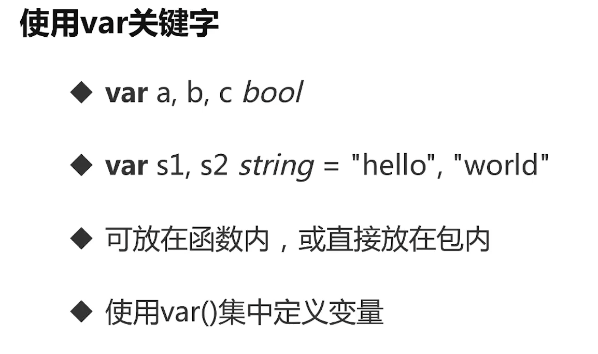
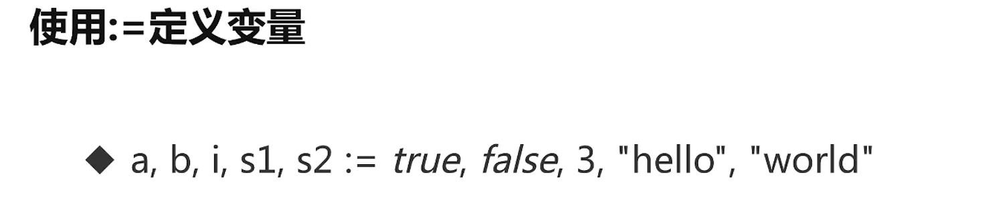

# 基础语法部分

## 关键字

Go语言中共有`25`个关键字，如下所示：

```go
break       default     func interface select
case defer go map         struct
chan        else goto package switch
const fallthrough if range type
continue    for import return var
```

此外,包含`36`个预定义标识符,如下所示:

```go
Constants: true false iota nil
Types: int int8 int16 int32 int64
uint uint8 uint16 uint32 uint64 uintptr
float32 float64 complex128 complex64
bool byte rune string error
Functions: make len cap new append copy close delete
complex real imag
panic recover
```

## 变量与常量

[variable()函数](./main.go)



### 变量声明

Go语言中,变量需要声明后才可以使用,同一作用域内不支持重复声明,且声明后必须使用,否则会报错.  
Go语言推荐驼峰式命名法,例如: `userName`  
声明代码如下:

```go
//标准单个声明
var 变量名 变量类型
// 例如
var name string
var age int
var isOk bool

//批量声明
var (
name string
age int
isOk bool
)

//短变量声明,可以自动判别类型,但是无法在函数外使用此声明方法
age, time, des := 5, 7, "这是一个描述" 
```

如在函数外声明,只能使用标准声明方法,且并全局变量,而是包内变量

### 内建变量类型

* bool,string
* (u)int,(u)int8,(u)int16,(u)int32,(u)int64,uintptr(指针)
* byte(8位),rune(字符,长度32位)
* float32,float64,complex64,complex128(复数)

### 强制类型转换

Go语言类型转换是强制的,例如说
sqrt()函数返回一个float64类型,但是我们需要一个int类型,那么就需要强制转换

```go
var c int
c = int(math.Sqrt(4))
//c = math.Sqrt(4)是会报错的
```

### 输出变量类型

```go
fmt.Printf("%T", c)
fmt.Println(reflect.TypeOf(c))
```

### fmt.Printf占位符

!!!

### 常量的定义

```go
const (
filename = "abc.txt"
a, b = 3, 4
)
var c int
c = int(math.Sqrt(a*a + b*b))
fmt.Println(filename, c)
```

const 数值可以作为各种类型使用,例如上述定义ab为int类型,但是在Sqrt函数中,要求参数为float64类型,仍然可以使用.

### 使用常量定义枚举类型

```go
//普通枚举类型
const(
cpp = iota
java
python
golang
js
)

//自增枚举类型
const (
b = 1 << (10 * iota)
kb
mb
gb
tb
pb
)

```

### 回顾

* 变量类型写在变量名之后
* 编译器可推测变量类型
* 有char，只有rune
* 原生支持复数类型

## 条件语句

### if语句

```go
func bounded(v int) int {
if v >= 100 {
return 100
} else if v < 0 {
return 0
} else {
return v
}
}
```

使用[io操作](io/io.go)进行条件语句示例.  
if语句可以直接赋值,且同时变量作用域只限制在这个if语句内.

### switch语句

switch会自动break,除非使用fallthrough强制执行后面的case代码.

```go

// eval switch有表达式的情况
func eval(a, b int, op string) float64 {
var result float64
switch op {
case "+":
result = float64(a + b)
case "-":
result = float64(a - b)
case "*":
result = float64(a * b)
case "/":
if b == 0 {
panic("除数不能为0")
}
result = float64(a) / float64(b)
default:
panic("不支持的操作子:" + op)
}
return result
}

// grade switch没有表达式的情况,需要添加判断语句
func grade(score int) string {
g := ""
switch {
case score < 0 || score > 100:
panic(fmt.Sprintf("Wrong score: %d", score))
case score < 60:
g = "F"
case score < 80:
g = "C"
case score < 90:
g = "B"
case score <= 100:
g = "A"
default:
panic(fmt.Sprintf("Wrong score: %d", score))
}
return "得分为" + g
}
```

## for循环

### 初始化,条件,后置语句三要素都有

```go
var sum int
for i := 0; i < 10; i++ {
fmt.Println(i)
sum += i
}
```

### 单条件循环(类while)

```go
func PrintFile(filename string) {
// 读取文件内容
contents, err := os.Open(filename)
if err != nil {
panic(err)
}
scanner := bufio.NewScanner(contents)
for scanner.Scan() {
fmt.Println(scanner.Text())
}
}
```

### while True循环

```go
for {
fmt.Println("1")
}
```

## 函数

* 函数没有默认参数
* 函数可以返回多个值
* 函数返回多个值时,可以起名字,对调用者而言没有区别

```go
func div(a, b int) (q, r int) {
q = a / b
r = a % b
return
}
```

* 函数可以作为变量的值

```go
func apply(op func (float64, float64) float64, a, b float64) float64 {
p := reflect.ValueOf(op).Pointer() //返回指向函数的指针
opName := runtime.FuncForPC(p).Name() //返回函数名
fmt.Println("执行函数:", opName, "with args", a, " ", b)
return op(a, b)
}
//在使用时可以直接使用 
apply(func (a, b float64) float64 {return a+b}, 1, 2) 达到使用匿名函数的效果
```

* 可变参数的设置

```go
func sum(num ...int) int {
s := 0
for _, j := range num {
s += j
}
return s
}
```

### 指针

* 指针不能做运算
* 指针的值为nil时,不能进行解引用操作
* Go语言的参数传递为引用传递

```go
func passByValue(a int) {
a += 1
}

func passByPointer(a *int) {
*a += 1
}

func pointerTypeCheck() {
a, b := 3, 3
passByValue(a)
passByPointer(&b)
fmt.Println("值传递", a)
fmt.Println("指针传递", b)

}
```

## 数组

### 数组的定义方法

```go
    var arr1 [5]int // 默认为0
arr2 := [3]int{1, 2, 3} //需要赋初值
arr3 := [...]int{1, 2, 3, 4, 5, 6, 7, 8, 9}
```

### 数组是值类型

```go
func printArray(arr [5]int) {
fmt.Println("要求数组长度必须是5,否则无法传入")
for i := range arr {
fmt.Println(i)
}
}
arr1, arr2, arr3 := arrays()
printArray(arr1)
printArray(arr2) // 无法使用 会报错,因为数组是值类型,传递的是值的拷贝
printArray(arr3)
```

## 切片(Slice)

go语言不常用数组，因为数组需要限制长度,更多的是使用切片Slice !!!挖坑,限制长度的优势是什么,什么时候需要使用到数组

### 创建切片

```go
func initSlice() {
var s1 []int // 声明一个空的切片
fmt.Println(s1) //[]
s2 := make([]int, 16) // 声明一个长度和容量都为16的切片
s3 := make([]int, 10, 32) // 10是长度,32是容量
fmt.Println(len(s2), cap(s2))
fmt.Println(s2)
fmt.Println(len(s3), cap(s3))
fmt.Println(s3)
//s3[32] = 100 // 超出容量会报错,index out of range [33] with length 10
s3 = append(s3, 100) // 超出长度,会自动扩容
fmt.Println(s3)
}
```

### 引用类型实例

**切片是引用类型，修改原数组，切片也会跟着变化,放在函数中进行修改后,原slice也会跟着修改**

```go
fmt.Println("学习切片")
arr := [...]int{1, 2, 3, 4, 5, 6, 8}
s1 := arr[3:5] // 与Python相似
s2 := arr[:5]
s3 := arr[3:]
s4 := arr[:]
fmt.Println(reflect.TypeOf(s1))
fmt.Println("修改原数组前")
fmt.Println("arr[3:5]", s1)
fmt.Println("arr[:5]", s2)
fmt.Println("arr[3:]", s3)
fmt.Println("arr[:]", s4)
fmt.Println("修改原数组后")
arr[3] = 100
fmt.Println("arr[3:5]", s1)
fmt.Println("arr[:5]", s2)
fmt.Println("arr[3:]", s3)
fmt.Println("arr[:]", s4)
}
```

### 切片的扩展(重要,垃圾回收机制的体现)

切片的容量是从切片的第一个元素到原切片的最后一个元素的长度,切片的长度是切片的最后一个元素的索引+1

```go

var s1 []int // 声明一个空的切片
fmt.Printf("s1 len:%d,cap%d,value:%v  \n", len(s1), cap(s1), s1) //[]
for i := 0; i < 67; i++ {
s1 = append(s1, i) // 追加元素,当容量不足时,会自动扩展长度(垃圾回收机制,生成新的变量,删除原变量,地址发生变化)
if i%3 == 0 {
fmt.Printf("s1 len:%d,cap%d,value:%v \n", len(s1), cap(s1), s1)
println(s1)
}
}
```

```go
func extendSlice() {
arr := []int{1, 2, 3, 4, 5, 6, 8}
s1 := arr[2:6]
s2 := s1[3:5]
fmt.Println(s1)
fmt.Println(s2, "为什么是[6 8]?")
fmt.Println("s1的长度", len(s1), "容量", cap(s1))
fmt.Println("s2的长度", len(s2), "容量", cap(s2))
fmt.Println("从s1的容量可以看出,切片是引用类型,切片的容量是从切片的第一个元素到原切片的最后一个元素的长度,仅仅只是新建了一个指针,该指针指向了原数组的要切分的第一个元素")
fmt.Println("所以s2其实是指向s1的第三个元素,也就是原切片的第五个元素,所以s2的长度是2,容量是2")
println(arr[2:])
println(s1)
println(s1[3:])
println(s2)
fmt.Println("通过println方法打印Slice的ptr,可以验证以上说法,两个切片指向同一个地址且长度相同,区别在于容量")
}

```

### 删除元素

go语言没有内置的删除元素的方法,需要自己实现

## map

### 新建map

```go
m := map[string]string{
"name":  "李梦洋",
"age":   "18",
"email": "betterlmy@icloud.com", // 必须有逗号
}

m2 := make(map[string]int) // m2 空map
var m3 map[string]int      // m3 nil
```

### map的遍历

```go
for k, v := range m {
fmt.Println(k, v)
}
```

map在获取元素时,可以添加两个返回值,第二个返回值用于判断是否存在该键

```go
x, isExist := m["gender"]
fmt.Println(reflect.TypeOf(x), isExist)
```

### 删除元素

```go
delete(m, "qq")
```

### key的要求

* key必须是可以比较的类型,比如int,string等,不包括slice,map,function
* 自建类型不包含上述字段时,也可作为key

## rune

rune 即 int32的别名

```go
func runeInit() {
s := "Yes我爱你!" // 一个中文占4个字符长度,即32位,在go中 rune=int32,所以说string就是由rune组成的
fmt.Println("直接输出len(s),长度为:13", len(s))
for _, v := range s {
fmt.Print(string(v) + " ")

fmt.Print("十进制:" + strconv.Itoa(int(v)))
fmt.Printf(" %T ", v)
fmt.Printf("16进制:%X \n", v)
}
fmt.Println("使用for循环,循环次数为:7")
// 为了获取rune的长度,需要使用utf-8库
fmt.Println("使用utf-8库,获取的长度", utf8.RuneCountInString(s))
fmt.Println('a', "a") //单引号为utf-8的rune类型,双引号为string类型
a := 'a'
fmt.Println(reflect.TypeOf(a))
fmt.Printf("%c", a) // 使用string()方法或者%c将单个rune转换为string
}
```

## strings包

## struct

go语言仅支持封装,不支持继承和多态,使用接口完成多态  
go语言没有class,只有struct

### struct定义

无论是地址还是结构,一律使用.进行访问

```go
func structInit() {
var root1 TreeNode
fmt.Println(root1)

root2 := TreeNode{Left: &root1, Value: 1}
root2.Right = &TreeNode{nil, nil, 5}
fmt.Println(root2)
fmt.Println(root2.Right.Value)
}
```

### 限定接受体的方法(class的方法)

```go
// 限定接受体的方法
func (node *TreeNode) print() {
if node.Value != 0 {
fmt.Println("未赋初值")
}
fmt.Println(node.Value)
}

```

注意点:

* 使用指针做为方法的接收者时才可以改变结构体的内容
* nil指针也可以调用方法
* 一致性原则,一个结构体定义的方法最好从指针接收者或者值接收者选择一个,方便进行编译器的优化

## 包(Package)

### 包的基本要求

* 每个目录一个包,包名可以与目录名不停
* main包中包含了可执行入口
* 为结构定义的方法必须与结构放在同一个包内
* 同一个包内的标识符(变量,函数,结构,接口等)不能重名

### 扩充系统类型或他人的类型(继承)

* 定义别名

```go
type Stack []int
```

* 使用组合

```go
type MyTreeNode struct {
// 通过组合的方式进行继承
node *TreeNode
}
```

* 使用内嵌的方式扩展

